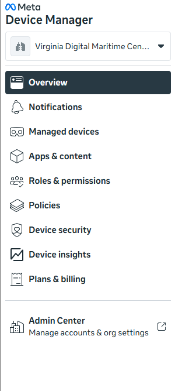
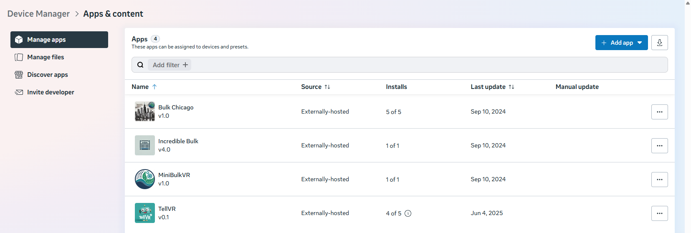
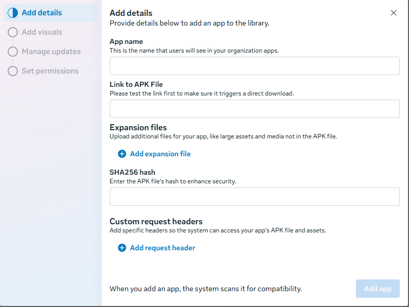
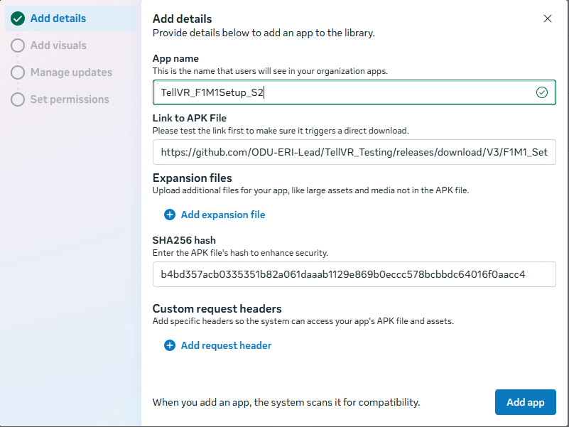
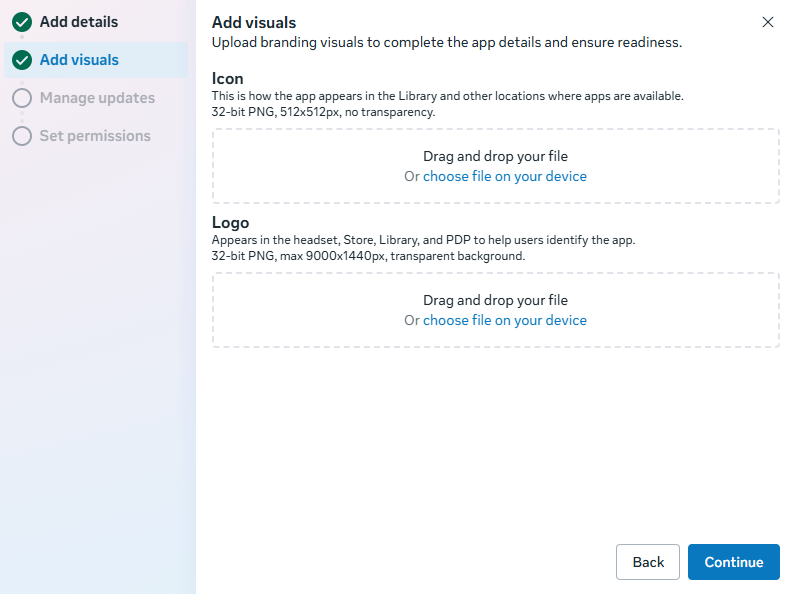
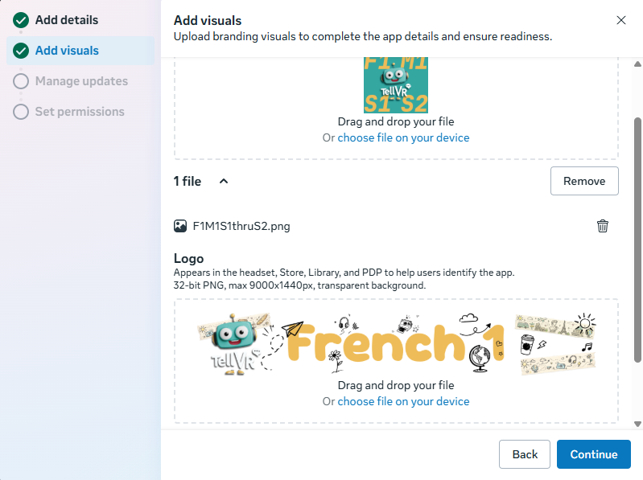
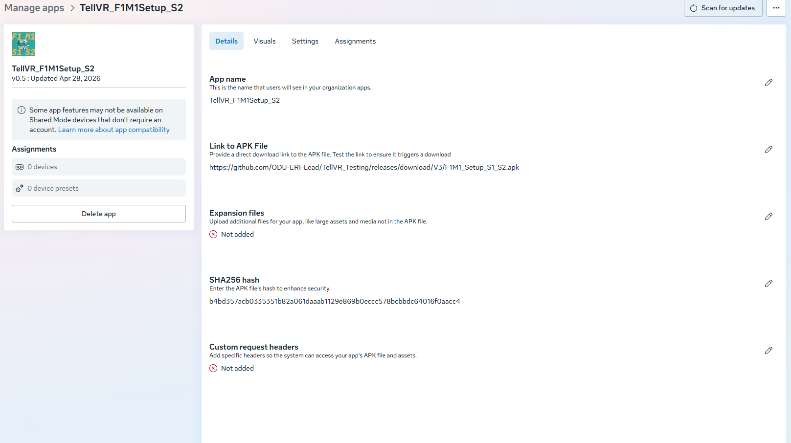

# Meta Work Setup Instructions

This APK is already being hosted on GitHub in a public way. To use this APK in your Meta Work Managed environment please follow the instructions below.

## Access Meta Device Manager

Login to your Meta Work Account and proceed to the [device manager area of Meta Work](devicemanager.meta.com), on the left hand toolbar look for the 'Apps & Content' section.

### Add an Application

We are now going to add an application that is publicly hosted through the Meta Work Managed apps section.

In the upper right corner click the 'Add app' button and look for **'Externally hosted'**.

A pop up window with some details are now needed for you to fill out.

The application name, link, and SHA256 will be provided for you for each apk build. For our example purposes please see that information below

* Version: 0.6.8
* Updated 5/28/2026 2:59PM
* Application Name: TellVR_F1M1Setup_S2
* APK Link: [https://github.com/ODU-ERI-Lead/TellVR_Testing/releases/download/0.6.8/F1M1_Setup_S1_S2.apk](https://github.com/ODU-ERI-Lead/TellVR_Testing/releases/download/0.6.8/F1M1_Setup_S1_S2.apk)
* SHA256: f34212dba86595fd0b4dceac0376214da89ab9cee12203de41c78519716a8f65
* Module: French Module 1
* Scene(s): Setup, Unpacking, Test Plane

You will also be provided with an Icon file and a Logo file. The icon will be 512x512 and have the module and scene index on it. The logo file will probably only vary between French and Spanish and generally be the same.

Banner Image: https://github.com/ODU-ERI-Lead/TellVR_Testing/blob/main/MetaLogos/FrenchOneBannerV2.png

Logo Image: https://github.com/ODU-ERI-Lead/TellVR_Testing/blob/main/MetaLogos/F1M1S1thruS2.png

For the Manage updates section, just leave automatic on and you should be done.

If you noticed compatibility errors - just ignore these as we are using some SDK tools from Meta that throw up some warning flags tied to devices in a shared mode use case.

